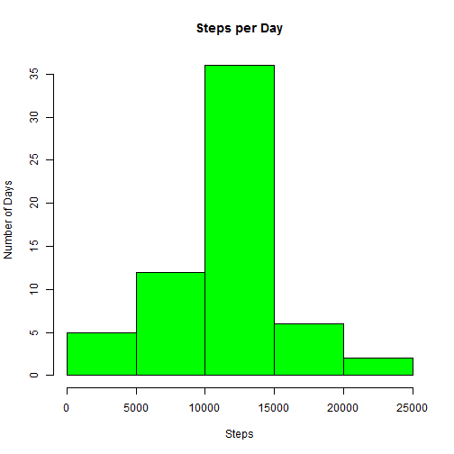

Reproducible Research - Peer Assessment 1
=========================================


**Unzip folder from github repo, read data file into R, subset complete cases, & load needed packages.**

```r
unzip("activity.zip")
data <- read.csv("activity.csv")
library(plyr)
library(xtable)
library(lattice)
complete_data <- data[which(data$steps!="NA"),]
```


**What is mean total number of steps taken per day (complete cases only)?**

```r
steps_day <- ddply(complete_data,.(date),summarise,steps=sum(steps),drop=TRUE)
hist(steps_day$steps,xlab="Steps",ylab="Number of Days",main="Steps per Day",col="green")
```

 

```r
daily_mean <- as.numeric(format(mean(steps_day$steps),scientific=FALSE))
daily_median <- as.numeric(median(steps_day$steps))
```
Summary Stats for Steps per Day:   

* *mean = 1.076619 &times; 10<sup>4</sup> steps per day*  
* *median = 1.0765 &times; 10<sup>4</sup> steps per day*   


**What is the average daily pattern?**

```r
steps_interval <- ddply(complete_data,.(interval), summarise, steps=mean(steps))
plot(1:288,steps_interval$steps,type="l",xlab="5-minute interval",ylab="Average Steps Taken",main="Average Daily Activity Pattern",col="blue")
```

 

```r
colnames(steps_interval)[2] <- "interval_mean"
max_steps <- round(max(steps_interval$interval_mean))
max_interval <- as.numeric(which.max(steps_interval$interval))
```
*Interval 288* represents the highest 5-minute interval in terms of average steps taken per day, with an average of *206 steps* taken during this interval across all days.


**Imputing missing values**

```r
num_na <- sum(is.na(data$steps)=="TRUE")
```
There are *2304 rows* with "NA" values in the original dataset.  

Next, create a new dataset by replacing each "NA" value with the mean steps for that interval.

```r
data_replace <- arrange(join(data, steps_interval), interval)
```

```
## Joining by: interval
```

```r
data_replace$steps[is.na(data_replace$steps)] <- data_replace$interval_mean[is.na(data_replace$steps)]
data_replace <- data_replace[,1:3]
data_replace$steps <- round(data_replace$steps,2)
data_replace$date <- as.POSIXct(data_replace$date)
data_replace <- data_replace[order(data_replace$date,data_replace$interval),]
rownames(data_replace) <- NULL
```
Create a histogram of total number of steps taken each day and calculate and report the mean and median total number of steps taken per day.   
Do these values differ from the estimates from the first part of the assignment? What is the impact of imputing missing data on the estimates of the total daily number of steps?


```r
replace_steps_day <- ddply(data_replace,.(date),summarise,steps=sum(steps),drop=TRUE)
hist(replace_steps_day$steps,xlab="Steps",ylab="Number of Days",main="Steps per Day",col="green")
```

 

```r
replace_daily_mean <- as.numeric(format(mean(replace_steps_day$steps),scientific=FALSE))
replace_daily_median <- as.numeric(median(replace_steps_day$steps))
```
Below is a table comparing the mean and median steps per day for the original dataset compared to the same statistics for the dataset with "NA" values replaced by the mean steps taken for that given interval.  Although the values differ slightly, our data replacement strategy did not have a large impact on the mean and median.

```r
stat_table <- matrix(c(daily_mean,replace_daily_mean,daily_median,replace_daily_median),ncol=2)
rownames(stat_table) <- c("original data", "imputed data")
colnames(stat_table) <- c("mean", "median")
stat_table <- xtable(stat_table)
print(stat_table, type="html")
```

<!-- html table generated in R 3.1.2 by xtable 1.7-4 package -->
<!-- Sun Dec 14 13:47:43 2014 -->
<table border=1>
<tr> <th>  </th> <th> mean </th> <th> median </th>  </tr>
  <tr> <td align="right"> original data </td> <td align="right"> 10766.19 </td> <td align="right"> 10765.00 </td> </tr>
  <tr> <td align="right"> imputed data </td> <td align="right"> 10766.18 </td> <td align="right"> 10766.13 </td> </tr>
   </table>

**Are there differences in activity patterns between weekdays and weekends?**

```r
weekdays <- weekdays(data_replace$date)
weekday_data <- transform(data_replace, day=weekdays)
weekday_data$wk <- ifelse(weekday_data$day %in% c("Saturday", "Sunday"),"weekend", "weekday")
interval_average_wk <- ddply(weekday_data, .(interval, wk), summarise, steps=mean(steps))

xyplot(steps ~ interval | wk, data = interval_average_wk, layout = c(1, 2), type="l")
```

 

As seen in the plot above, there are differences in activity patterns between weekdays and weekends.  There seems to be move overall activity on the weekends, and it also looks like people sleep in a bit later and stay awake later on the weekends!
